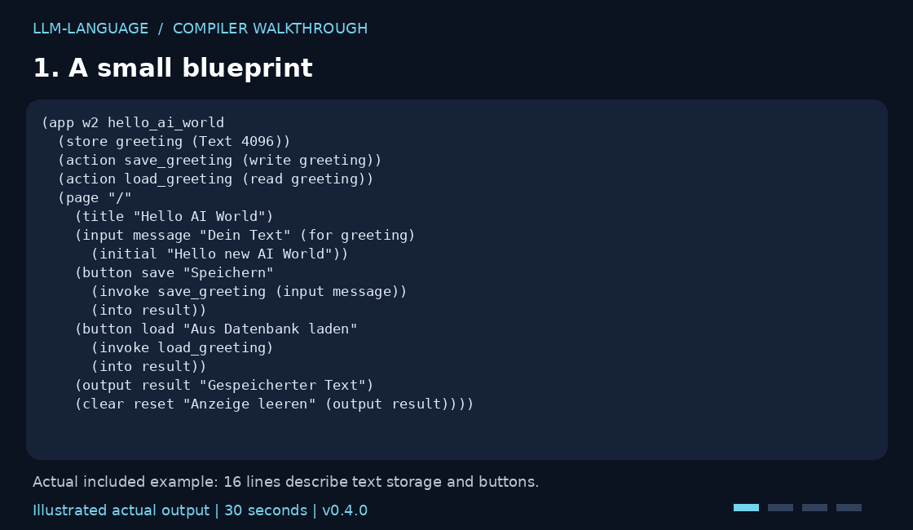
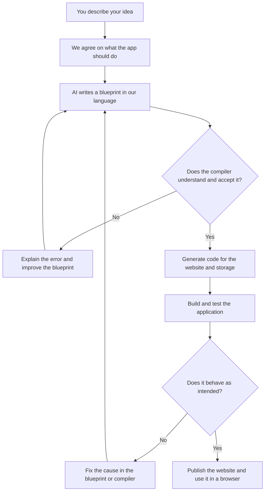

# LLM-Language · The Software Factory

**A programming language that helps AI build software — with tools that check its work.**

Imagine a workshop: you describe what you need. AI writes the blueprint.
A translator turns it into an application. Checking tools help find mistakes
before you use it.

That is what we are building. Our first small website already works.

**[Try it yourself](docs/QUICKSTART.md)** · **[Compiler source](src/llmlang/web)** · **[How to contribute](CONTRIBUTING.md)**

**Progress:** [Milestones](https://github.com/ShadowsInThe-Space/llm-language-mvp/milestones)
· [Changelog](CHANGELOG.md) · [Releases](https://github.com/ShadowsInThe-Space/llm-language-mvp/releases)
· [Delivery workflow](docs/RELEASE-WORKFLOW.md).
One completed milestone means one final merge and one release. The `milestone/m2`
branch is work in progress; v0.5.0 remains the published release until M2 is accepted.

## The idea, with an example

You want:

> “A website where I can save notes and read them again later.”

Normally, several pieces need to fit together: the page you see, the work
happening behind it, and a place to store your notes.

Our language describes these pieces in **one shared blueprint**.
The **compiler** is the translator: it turns that blueprint into code for
the website and its connection to storage. Your browser displays an ordinary
website. It does not need a special extension.

## See the compiler in 30 seconds

*Illustrated output from actual commands, not a screen recording.
[Text version and commands](docs/QUICKSTART.md) · [Run evidence](docs/launch/validation.json).*

## From an idea to a website

This is the development workflow for our small web application:

Today, setup and human review are still part of the process. A factory that
can finish many different kinds of apps on its own is our long-term goal.

## What already works

Our example website is a small notebook:

1. **Write something:** for example, `Hello new AI World`.
2. **Save it:** the text goes into a database — the app's memory.
3. **Find it again:** a list shows the beginning of each saved note.
4. **Read it:** your chosen note is loaded from storage.
5. **Clear the display:** the note disappears from the screen, but stays saved.

**[Open the example website](https://hello-ai-world.adaptiveaisolutions.chatgpt.site)**

*Screenshot from browser testing. The page was generated from our language.
The demo interface is currently in German.*

## Why check the AI's work?

Because AI makes mistakes too. “Looks right” is not enough.

For certain calculation rules, our tools can already check mathematically
whether a program follows the agreed rule. For example:
**“You cannot spend more points than you have.”**

Think of a very precise referee: it checks the rule we wrote down.
It cannot know whether we forgot an important rule.

**The whole website is not mathematically proven correct.** It is checked
with code analysis and tests. See the [v0.5.0 release notes](docs/releases/v0.5.0.md)
for the release scope and validation, and [GitHub Actions](https://github.com/ShadowsInThe-Space/llm-language-mvp/actions)
for the current regression checks.

## What comes next?

We want to turn this small workshop into a more flexible software factory.
Local **libraries** for pure calculation rules now work: reusable building blocks,
a bit like LEGO. Two different example programs share the same library, with
complete-program proof checks and rejection of stale evidence after changes.
Run the [library reuse demo](docs/PKG1-GUIDE.md#reproduzierbare-m1-abnahme).
General web libraries remain a later milestone.

Planned examples include a customer management app and an event booking
website. These extensions are **not implemented yet**.

## Want to look inside?

The current compatibility contract is [M0 baseline](specs/M0-BASELINE.md).
It defines which existing profiles are normative and the gates required before
package/module development begins.

Local pure P0 packages now support explicit imports/exports, deterministic linking
and independent source-to-Core binding checks. Try the [pkg1 workflow](docs/PKG1-GUIDE.md).
General web libraries remain a later milestone.

Start with the English quickstart. The detailed language specifications are currently in German.

- **Find the compiler:** [src/llmlang/web](src/llmlang/web) · [Start with build.py](src/llmlang/web/build.py)
- **Run it yourself:** [English quickstart](docs/QUICKSTART.md) · [Detailed technical guide (German)](docs/TECHNICAL-GUIDE.md)
- **Build websites:** [Compiler, architecture and deployment](docs/W1-GUIDE.md)
- **Explore the language:** [Calculation rules](docs/P0.md) · [Websites](docs/W1-SPEC.md) · [Saved text history](docs/W2-SPEC.md)
- **Understand the checks:** [What the proofs cover](docs/ASSURANCE.md) · [Browser acceptance report](docs/W1-ABNAHME.md)
- **Follow the plans:** [Development roadmap](docs/LLM-Language-Weiterentwicklungsplan.md) · [Decision log](Log.md)

*Current version: 0.5.0 — Developer Preview · [KPDL 1.1 — LLM-Language edition](LICENSE)*

Copyright © 2026 Marc-Dennis Haberland, the sole project rights holder named
in this license. This project-specific KPDL edition permits use, modification
and proprietary applications subject to its attribution and licensing terms.
Companies with annual group revenue of EUR 3 million or more require an
enterprise license; research use is governed by Section 11. See [LICENSE](LICENSE)
for the complete terms and [NOTICE](NOTICE) for scope and historical attribution.

For licensing enquiries, [open an issue titled “Lizenzanfrage”](https://github.com/ShadowsInThe-Space/llm-language-mvp/issues/new?title=Lizenzanfrage).
