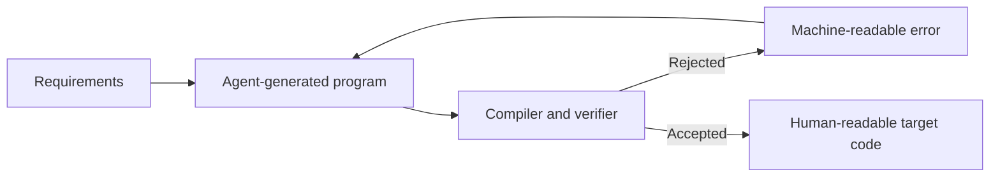

# LLM-Language · The Software Factory

**An experimental language and software factory where AI agents generate software that is independently checked before it is accepted.**

The goal is not to replace Python, Rust or C.

The goal is to give autonomous agents a small, deterministic representation for describing software, checking important properties and generating familiar, human-readable target code.

**[Try the generated note app](https://hello-ai-world.adaptiveaisolutions.chatgpt.site)** · **[Run the compiler in 60 seconds](docs/QUICKSTART.md)** · **[See what is verified](docs/ASSURANCE.md)**

> Developer preview. The project can already compile a small web blueprint, verify generated-file integrity and formally check bounded calculation rules. It is not yet a general-purpose language or an autonomous software factory.

## Why not just let an LLM write Python?

Modern LLMs can already write Python, Rust, C and many other languages. Understanding those languages is not the problem.

The problem is that an agent still has to navigate flexible syntax, implicit behavior, large APIs and many equivalent ways to express the same idea. That increases the search space and leaves correctness dependent on the model's judgment.

LLM-Language explores a different workflow:

1. A human describes the required behavior and constraints.
2. An agent generates a compact, explicit program.
3. The compiler checks its structure and meaning.
4. Independent verification checks the supported guarantees.
5. Failed checks return machine-readable errors for repair.
6. Accepted programs can generate ordinary target code.

The model proposes. The compiler and verifier decide what is accepted.

## See it working

The current web example describes a small note application in one 16-line blueprint:

> “A website where I can save notes, load them again and clear the display without deleting the saved data.”

The compiler turns that blueprint into React/Vinext source, server operations, database schema and a reproducible build manifest. The result is an ordinary website that runs in a normal browser.


**[Open the generated note app](https://hello-ai-world.adaptiveaisolutions.chatgpt.site)**

*The interface is currently in German. Depending on its access settings, the hosted demo may require the owner's permission.*

## Try the compiler

No AI account or API key is required. The quickstart uses included examples and makes no model request.

```bash
git clone https://github.com/ShadowsInThe-Space/llm-language-mvp.git
cd llm-language-mvp
git checkout v0.5.0
python3 -m venv .venv
source .venv/bin/activate
python -m pip install -e .

python -m llmlang compile-web examples/web/hello-history.llapp \
  --out build/my-first-webapp

python scripts/demo.py
```

The web command generates source files; it does not start a complete local web stack. The separate proof demo replays a rejected program and its repaired replacement. See the **[English quickstart](docs/QUICKSTART.md)** for expected output, Windows notes and the exact integrity check.


## What works today

| Capability | Current status |
| --- | --- |
| Compile a declarative note-app blueprint | Working |
| Generate page, server and database source | Working |
| Detect changes to generated files | Working integrity check |
| Reject invalid bounded calculation programs | Working for the supported P0 subset |
| Independently reconstruct proof certificates | Working within the documented trusted base |
| Reuse local pure calculation libraries | Working |
| Structured bounded domain data | Developer Preview in A1 |
| Generate standalone JavaScript for A1 programs | Working for the supported subset |
| Generate arbitrary production applications autonomously | Not implemented |
| Prove the complete generated website correct | Not implemented |

## What “verified” means here

For supported calculation rules, a program can carry evidence that its implementation satisfies stated preconditions and postconditions for every valid input in the formal model.

That is stronger than testing a collection of examples, but it is not magic:

- A proof cannot detect a missing or incorrect requirement.
- The compiler, checker, runtime, operating system and hardware are not all formally proven.
- The generated note website is checked with tests, static analysis and reproducible build integrity. The whole website is **not** mathematically proven correct.

The precise assurance boundary and trusted computing base are documented in **[Assurance and known limits](docs/ASSURANCE.md)**.

## The direction

The long-term goal is a software factory in which specialized agents can specify, generate, verify, repair and compile software without treating an LLM's confidence as evidence of correctness.

The language itself should stay small and unambiguous. Capabilities such as web applications, databases, networking, graphics and AI should grow through explicit libraries and target backends rather than turning the core language into one large feature collection.

Human-readable code remains an output. The agent-optimized language changes how software is created and checked, not whether humans can inspect the result.

## Architecture at a glance



Today, setup, review and release decisions still involve humans.

## Explore the project

- **Start here:** [English quickstart](docs/QUICKSTART.md)
- **Understand the guarantees:** [Assurance and known limits](docs/ASSURANCE.md)
- **Inspect the compiler:** [src/llmlang](src/llmlang)
- **Read the language specifications:** [specs](specs)
- **Build the web example:** [Web compiler and deployment guide](docs/W1-GUIDE.md)
- **Try reusable local libraries:** [pkg1 guide](docs/PKG1-GUIDE.md)
- **See what changed:** [Changelog](CHANGELOG.md) · [Releases](https://github.com/ShadowsIn-The-Space/llm-language-mvp/releases)
- **Follow development:** [Milestones](https://github.com/ShadowsIn-The-Space/llm-language-mvp/milestones) · [Decision log](Log.md)
- **Contribute:** [Contribution guide](CONTRIBUTING.md)

## Project status

Current version: **0.6.0 Developer Preview candidate**

P0, w1, w2 and pkg1 remain protected by compatibility tests. A1 adds immutable records, closed variants, bounded lists and text, deterministic interpretation, structural proof certificates and standalone JavaScript generation for its supported subset. See the [v0.6.0 scope](docs/releases/v0.6.0.md).

## License

Copyright © 2026 Marc-Dennis Haberland.

This project uses the [KPDL 1.1 — LLM-Language edition](LICENSE). It permits use, modification and proprietary applications subject to its attribution and licensing terms. Companies with annual group revenue of EUR 3 million or more require an enterprise license; research use is governed by Section 11.

See [LICENSE](LICENSE) for the complete terms and [NOTICE](NOTICE) for scope and historical attribution. For licensing enquiries, [open an issue titled “Lizenzanfrage”](https://github.com/ShadowsIn-The-Space/llm-language-mvp/issues/new?title=Lizenzanfrage).
