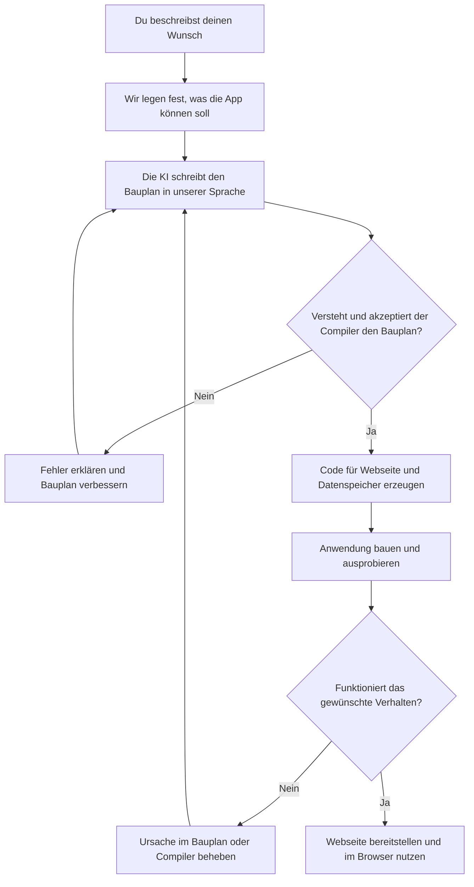
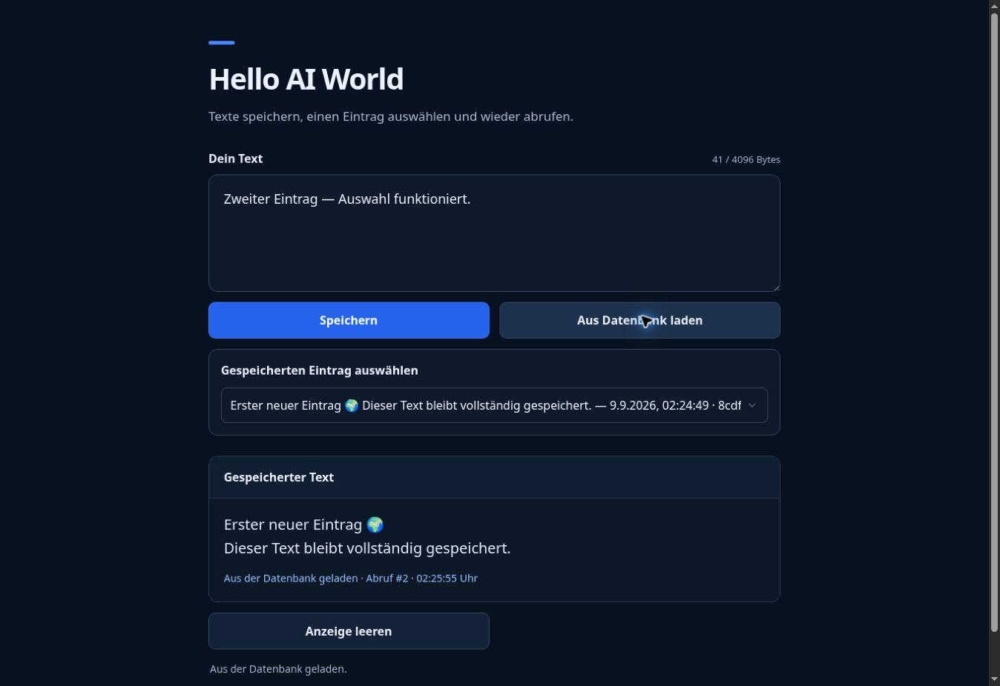

# LLM-Language · Die Software-Fabrik

**Eine eigene Programmiersprache, mit der KI Software bauen kann – und Werkzeuge, die ihre Arbeit überprüfen.**

Stell dir eine Werkstatt vor: Du sagst, was du brauchst. Die KI schreibt den Bauplan.
Ein Übersetzer macht daraus eine Anwendung. Prüfwerkzeuge helfen dabei,
Fehler zu finden, bevor du die Anwendung benutzt.

Genau daran arbeiten wir. Die erste kleine Webseite funktioniert bereits.

## Die Idee in einem Beispiel

Du möchtest:

> „Eine Webseite, auf der ich Texte speichern und später wieder lesen kann.“

Normalerweise müssen dafür mehrere Teile zusammengebaut werden: die sichtbare
Seite, die Arbeit im Hintergrund und ein Speicher für deine Texte.

Mit unserer Sprache beschreiben wir diese Teile in **einem gemeinsamen Bauplan**.
Der **Compiler** ist der Übersetzer: Er macht daraus den Code für die Webseite
und ihre Verbindung zum Speicher. Dein Browser zeigt anschließend eine normale
Webseite an. Er braucht dafür keine besondere Erweiterung.

## Vom Wunsch zur Webseite

So läuft die Entwicklung unserer kleinen Webanwendung ab:

Heute gehören dazu noch Einrichtung und gemeinsame Abnahme. Eine Fabrik,
die beliebige Apps ganz allein fertigstellt, ist unser langfristiges Ziel.

## Das funktioniert schon

Unsere Beispielseite ist wie ein kleines Notizbuch:

1. **Text schreiben:** zum Beispiel `Hello new AI World`.
2. **Speichern:** Der Text kommt in die Datenbank – das Gedächtnis der App.
3. **Wiederfinden:** Die Auswahl zeigt die Anfänge der gespeicherten Texte.
4. **Anzeigen:** Ein ausgewählter Text wird aus dem Speicher geladen.
5. **Anzeige leeren:** Der Bildschirm wird geleert. Der Text bleibt gespeichert.

**[Die Beispielseite öffnen](https://hello-ai-world.adaptiveaisolutions.chatgpt.site)**

*Screenshot aus der Browserprüfung. Die Seite wurde aus unserer Sprache erzeugt.*

## Warum lassen wir die KI nicht einfach machen?

Weil auch eine KI Fehler macht. „Sieht richtig aus“ reicht uns deshalb nicht.

Für bestimmte Rechenregeln können unsere Werkzeuge schon mathematisch prüfen,
ob ein Programm die festgelegte Regel einhält. Zum Beispiel:
**„Du darfst höchstens so viele Punkte ausgeben, wie du besitzt.“**

Das ist wie ein sehr genauer Schiedsrichter: Er prüft die vereinbarte Regel.
Er kann aber nicht wissen, ob wir eine wichtige Regel vergessen haben.

**Die ganze Webseite ist noch nicht mathematisch bewiesen.** Sie wird mit
Codeprüfungen und Tests kontrolliert. Beim letzten vollständigen Testlauf am
13. September 2026 bestanden **309 Tests**.

## Was kommt als Nächstes?

Wir wollen aus der kleinen Werkstatt eine vielseitige Software-Fabrik machen.
Dafür planen wir **Bibliotheken**: wiederverwendbare Bausteine, ähnlich wie LEGO.
Mit ihnen sollen neue Apps entstehen, ohne den Übersetzer jedes Mal umzubauen.

Geplante Beispiele sind eine Kundenverwaltung und eine Seite zum Buchen von
Veranstaltungen. Diese Erweiterungen sind **noch nicht umgesetzt**.

## Du möchtest tiefer einsteigen?

- **Compiler-Code finden:** [src/llmlang/web](src/llmlang/web) · [Einstiegspunkt: build.py](src/llmlang/web/build.py)
- **Selbst starten:** [Installation und technische Anleitung](docs/TECHNICAL-GUIDE.md)
- **Webseiten bauen:** [Compiler, Aufbau und Betrieb](docs/W1-GUIDE.md)
- **Die Sprache verstehen:** [Rechenregeln](docs/P0.md) · [Webseiten](docs/W1-SPEC.md) · [Textverlauf](docs/W2-SPEC.md)
- **Prüfungen nachvollziehen:** [Was die Beweise abdecken](docs/ASSURANCE.md) · [Browserabnahme](docs/W1-ABNAHME.md)
- **Den Ausbau verfolgen:** [Weiterentwicklungsplan](docs/LLM-Language-Weiterentwicklungsplan.md) · [Entscheidungen](Log.md)

*Aktueller Stand: Version 0.4.0 · [MIT-Lizenz](LICENSE)*
