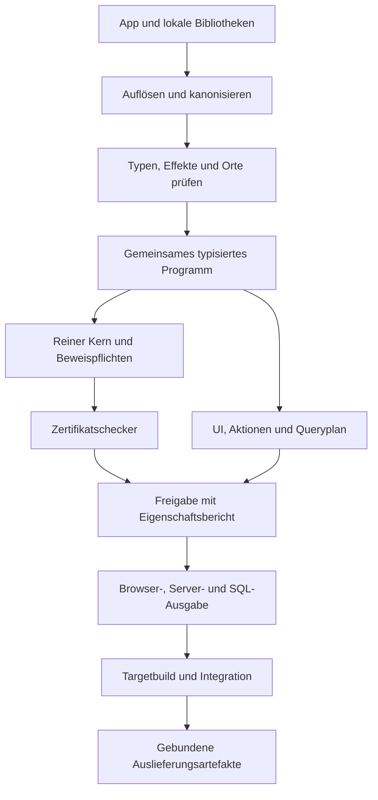
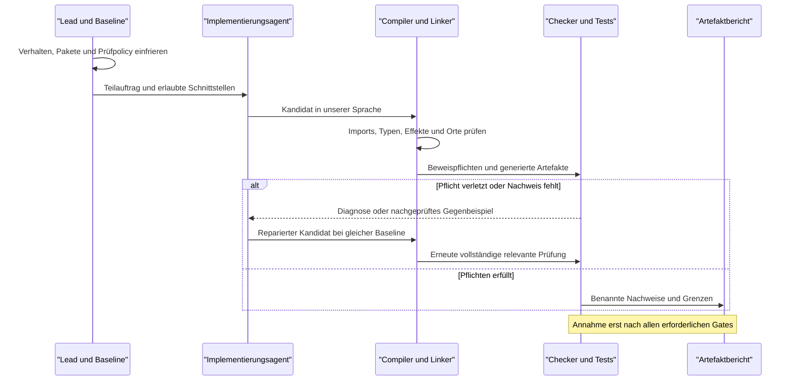

# LLM-Language: Compiler, allgemeine Sprache und Bibliotheken

Stand: 2026-09-09 · Planrevision 1 · Ausgangspunkt: Implementierung v0.4.0

**Ergebnis:** Wir entwickeln einen kleinen allgemeinen Sprachkern mit versionierten Bibliotheken und einem Compiler für vollständige Webanwendungen. Neue Fachfunktionen sollen als Sprachprogramme und Bibliotheken entstehen. Der Compiler übersetzt gemeinsame Typen, Aktionen, Oberflächen und Datenmodelle in zusammenpassenden Browser-, Server- und Datenbankcode.

**Status:** Architektur- und Ausbauplan, keine implementierte Erweiterung. Alle neuen Sprachformen, Dateiendungen und Paketnamen in diesem Dokument sind Entwurfsnotation. Vor jedem Implementierungsmeilenstein werden dessen Grammatik, Regeln, Diagnosen und Tests eingefroren. Bestehende Profile bleiben verbindlich; dieser Plan verändert ihre Semantik nicht.

## 1. Auftrag, Ausgangslage und Beleggrenzen

Sonny beauftragt die Planung mit einer Expertengruppe. Ziel sind unterschiedliche Webseiten, darunter Kundenverwaltung, Buchungsportale und später Shops, mit Bibliotheken statt wiederholter Compiler-Sonderfälle. Diese Arbeitsrunde implementiert und veröffentlicht keine neue Compiler-Version.

Geprüfter Quellstand: `llmlang-mvp` v0.4.0, Git-Commit `c54d3d92a9c830b73ddc1c1da3545b1508e63fdb`. Der lokale Arbeitsbaum war bei Beginn sauber; kein externes Git-Remote ist konfiguriert. Maßgebliche Quellen sind `src/llmlang/`, `docs/W1-SPEC.md`, `docs/W2-SPEC.md`, `docs/ASSURANCE.md`, `specs/06-P0-REVIEW-AMENDMENTS.md`, Tests und `Log.md`.

| Bereich | Tatsächlicher Stand | Konsequenz für den Ausbau |
| --- | --- | --- |
| P0 | Bool, mathematisches Int, begrenzte Ausdrucksbäume, nichtrekursive Funktionen, Verträge, Interpreter und Zertifikatschecker | Bewiesenen Kern erhalten; neue Semantik separat versionieren |
| Belege | Rationale Farkas-Belege und nachgeprüfte Integerzeugen; Z3 entscheidet nicht über Annahme | Kein vollständiger Entscheider für alle Integerprogramme oder Z3-Theorien |
| w1 | Ein Textwert pro Speicher, Ersetzen | Verhalten weiterhin reproduzierbar halten |
| w2 | Historie von Texteinträgen, Auswahl, lokale Anzeigenleerung, Abrufbestätigung, Idempotenz | Bereits nützlich, aber noch ein spezielles Formularprofil |
| Sprache | Eine Root-Seite; feste Widget-Union; `WebAction` enthält read/write und Storeverweis | Imports allein würden noch keine allgemeine Sprache schaffen |
| Compiler | Python; direkte Übersetzung des Web-AST in React/TypeScript, Vinext-Routen und Drizzle/D1-Schema | Bestehenden Zielstack weiterverwenden; keinen parallelen Python-Server einführen |
| Zwischenformat | `build._ir` serialisiert heute überwiegend den Web-AST | Noch keine unabhängige, allgemein typisierte Compiler-IR |
| Integrität | `verify_build` regeneriert eigene Ausgabedateien und vergleicht Bytes | Externer Starter, Target-Lockfile, finaler Worker und ausgeführte Migration noch nicht vollständig abgedeckt |
| Qualität | Historische Abnahme dokumentiert 309 Tests sowie Browser-/Buildprüfungen | In dieser Planungsrunde nicht neu ausgeführt; keine neue Testabnahme behauptet |
| Sicherheit | App-/Storebindung und private Bereitstellung; keine sprachinternen Benutzerkonten | Keine heutige Mandantentrennung oder allgemeine Benutzerautorisierung unterstellen |

Ältere Unterlagen mit Aussagen wie „kein Codegenerator“ beziehen sich auf P0 oder den damaligen Gesamtstand. Der Webcodegenerator existiert inzwischen, ist aber nicht formal als korrekt bewiesen. Die Notion-Übersicht wird mit diesem Unterschied aktualisiert.

## 2. Verbindliche Architekturentscheidungen dieses Plans

1. **Ein allgemeines neues Profil, Arbeitsname `a1`.** P0, w1 und w2 bleiben erhalten. Das Paketformat erhält eine eigene Versionskennung `pkg1`. Sprachversion, Paketformat, Zertifikatsformat, Target-ABI und Datenbankschema sind unterschiedliche Versionsachsen.
2. **Kernprimitiven statt Fachopcodes.** Funktionen, Datentypen, Fallunterscheidung, begrenzte Iteration, Effekte, Datenabfragen und UI-Komposition gehören zum Fundament. `book-ticket`, `crm-customer` oder `checkout` gehören nicht in den Compiler.
3. **Eigene Bibliotheken sind normale LLM-Language-Programme.** Sie besitzen explizite Schnittstellen und deklarierte Anforderungen. Keine Installationsskripte, Makros mit Dateisystemzugriff oder frei ausführbaren Compilerplugins.
4. **Referenzbackend bleibt `vinext-d1`.** Der Compiler bleibt Python. Browsercode bleibt HTML/CSS/JavaScript aus dem bestehenden React-/TypeScript-Build. Serverseitiger Code bleibt TypeScript auf dem bestehenden Worker-Target. PostgreSQL, Python-Backend, Wasm und native Ziele sind spätere, getrennte Vorhaben.
5. **Spezifikation bleibt von Kandidaten getrennt.** Agenten dürfen bei Reparaturen weder Produktvertrag noch freigegebene Paketauflösung, Effekte, Target oder Assurance-Anforderung abschwächen. Eine gewollte Änderung erzeugt eine neue Baseline mit sichtbarem Diff.
6. **Nachweise gelten für benannte Eigenschaften.** Typprüfung, Vertragsbeweis, Übersetzungsbeweis, Integrationstest und Artefaktintegrität bleiben getrennte Aussagen. Eine Bibliothek macht eine gesamte Webseite nicht automatisch formal bewiesen.
7. **Flexibilität muss vorgeführt werden.** Spätestens nach dem ersten allgemeinen Webprofil entstehen zwei fachlich unterschiedliche Anwendungen aus derselben unveränderten Compiler-/Runtime-Version; eine weitere Fachänderung wird ohne Generatoränderung umgesetzt.

Die Entscheidung ist bewusst begrenzt: Neue primitive Fähigkeiten können künftig weiterhin eine Sprach- oder Backend-Erweiterung brauchen. Das Ziel lautet, neue Kombinationen und Geschäftsregeln mit vorhandenen Mitteln ausdrücken zu können, nicht jede denkbare Technologie ohne Erweiterung abzudecken.

## 3. Zuständigkeiten: Kern, Bibliothek und Adapter

| Fähigkeit | Im Sprach-/Compilerfundament | In Bibliotheken | Im Targetadapter |
| --- | --- | --- | --- |
| Daten und Berechnungen | Typen, Konstruktoren, Funktionen, Verträge, definierte Arithmetik | Kontingente, Preisregeln, Statusübergänge, Validierungsregeln | Exakte Darstellung und Wirecodec |
| Oberfläche | Getypte UI-Knoten, Zustandsmodell, Eventbindung, sichere Textausgabe | Formulare, Tabellen, Navigation, Karten, Dateiauswahl-Ansichten, Designsystem | DOM/React, CSS, Browserereignisse, Transport |
| Datenbank | Schema- und Query-Algebra, Referenzen, Bedingungen, atomare Transitionen | Wiederverwendbare Datenmodelle, History, CRM-Abfragen, Buchungsabläufe | SQL-Dialekt, D1-Aufrufe, Migrationsexekution |
| Zugriff | Effekt-/Ortsprüfung, opake Principal-/Capability-Typen | Eigentümer- und Mandantenregeln, Rollenpolitik | Prüfung von Session/Token und Erzeugung authentischer Identität |
| Außenwelt | Typisierte Effektaufrufe und Fehler, Ressourcenbudgets | Einbindung einer Zahlungs-, E-Mail- oder Suchschnittstelle | Provider-SDK, Credentials, Netzwerkzugriff, Signaturprüfung |

Auch `std.ui` und `std.db` bauen auf endlichen Compilerprimitiven auf. Wir nennen eine fest eingebaute Query- oder DOM-Operation nicht bloß „Bibliothek“, um die tatsächliche Grenze zu verdecken. Neue UI-Komponenten und Fachqueries müssen durch Komposition dieser Operationen möglich sein.

## 4. Allgemeiner Sprachkern und formale Semantik

### 4.1 Datentypen und Kontrollfluss

Der erste allgemeine Kern enthält `Unit`, `Bool`, mathematisches `Int`, begrenztes `Text`, Records, Varianten, `Option<T>`, `Result<T,E>` und begrenzte `List<T,N>`. Datensätze sind unveränderliche Werte; Persistenz ist ein expliziter Effekt. Identitäten wie `CustomerId` und `BookingId` erhalten nominal unterschiedliche Typen, damit gleich dargestellte Kennungen nicht austauschbar werden.

Funktionen haben explizite Parameter-/Ergebnistypen. `let`, `if`, Funktionsaufruf und vollständiges `match` bilden die erste Kontrollstruktur. Unbekannte Varianten und fehlende Zweige werden abgelehnt. `Option` ersetzt implizites Null; `Result` macht erwartbare Fehler sichtbar. Hostfehler werden in vereinbarte Fehlerkategorien übersetzt; sie erfüllen nicht automatisch einen fachlichen Erfolgsvertrag.

Generics sind zunächst erststufig und explizit instanziiert: keine Typklassen, implizite Überladung oder Laufzeitreflexion. Monomorphisierung erhält globale Instanz-/Größenlimits. Ein statisch typisierter Callback für `map`/`fold` darf spezialisierbar sein; beliebige dynamische Closures sind kein erster Meilenstein.

Listen werden über begrenzte Operatoren verarbeitet. Keine unbegrenzte Rekursion und kein freies `while` im ersten beweisbaren Profil. Große Datenmengen werden seitenweise abgefragt. Terminierung im endlichen Modell beweist keine akzeptable Laufzeit: Schritt-, Speicher-, Ausgabe-, Pfad- und Instanzbudgets werden zusätzlich geprüft und zur Laufzeit durchgesetzt.

### 4.2 Arithmetik und Text

| Thema | Festlegung |
| --- | --- |
| P0 | Bestehende mathematische Ganzzahlsemantik unverändert |
| a1 Int | Exakte Ganzzahlen; keine stille Umwandlung zu JavaScript `number` |
| Targettransport | Kanonische Dezimalstrings für große Ganzzahlen; validierter Codec; TS-intern `bigint` oder gleichwertig exakt geprüfte Repräsentation |
| Persistenz | Rangegeprüfte Maschinenwerte oder dezimale Textrepräsentation; SQL-Operationen auf Text-Ints werden nicht als mathematische Arithmetik ausgegeben |
| Maschinenzahlen | `I64` später mit expliziten checked-Operationen und `Result`; keine stille Wrap-Semantik |
| Division | Int erhält ein explizit euklidisches `int.divmod`: a=b*q+r und 0≤r<abs(b); b=0 liefert Fehler. `i64.div_checked` rundet gegen null und meldet Null sowie MIN/-1 als Fehler. Namen und Regeln verhindern implizites Vermischen |
| Geld | Fachtyp aus Betrag in kleinster Einheit und Währung; kein Gleitkomma als Gelddefault. Steuer-/Rundungsregeln sind Produktverträge |
| Text | Folge gültiger Unicode-Skalarwerte ohne U+0000, UTF-8-Grenzen explizit; keine implizite Normalisierung; Bytezahl und Anzahl Zeichen getrennte Operationen |
| Externe Eingaben | Strikte Form-/Längen-/Bereichsprüfung an jeder HTTP-/DB-/Adaptergrenze; Cast ersetzt keine Validierung |

I64-/Divisionsregeln sind geplant, keine Erweiterung der bisherigen Farkas-Belege. Bei einer neuen Arithmetikoperation müssen Interpreter, Zielübersetzung und Checker dieselbe Semantik erhalten. Neue Beweistheorien kommen mit neuen prüfbaren Regeln; ein bloßes Solver-`unsat` bleibt unzureichend.

Für Mengen-/Preisregeln wird allgemeine Multiplikation in a1 auswertbar vorgesehen. Der bisherige P0-Kern erlaubt nur Multiplikation mit syntaktisch konstantem Faktor. Neue variable Multiplikation oder Division bekommt deshalb keinen stillschweigend übernommenen P0-Beweisstatus. Die euklidische Int-Definition orientiert sich an der expliziten mathematischen Regel der SMT-LIB-Integer-Theorie; Zieloperatoren werden darauf angepasst. [SMT-LIB: Ints](https://smt-lib.org/theories-Ints.shtml)

Der erste D1-Adapter nutzt native numerische Bindungen/Rückgaben nur im sicheren Ganzzahlbereich von JavaScript, einschließlich geprüfter Zwischen- und Aggregatwerte. Größere Int-/I64-Werte passieren die Treibergrenze als kanonischer Dezimaltext und werden zunächst als Text gespeichert; numerische SQL-Operationen darauf sind nicht unterstützt. Ein voller SQLite-I64-Pfad braucht später einen explizit geprüften Text-/Cast-Codec. Es reicht nicht, erst nach einer bereits gerundeten Treiberrückgabe `bigint` aufzurufen. Pflichtfälle über den tatsächlichen Treiber: 2^53−1, 2^53, 2^53+1, negative Gegenstücke, I64-Min/Max und ungültige Dezimalformen. Jeder Wert kommt exakt zurück oder wird vor Mutation definiert abgelehnt.

Auswertungsreihenfolge und Fehler gehören zur Semantik. Insbesondere dürfen die heute eager ausgewerteten P0-Booloperatoren nicht ohne Nachweis zu JavaScript-Short-Circuit-Ausdrücken werden. `if` wertet weiterhin nur den gewählten Zweig aus. Kapazitätsverletzung beim Anhängen ergibt `Result`, Listenindex außerhalb der Länge `Option`; keine stille Abschneidung. Eine DB-Tabelle ist keine begrenzte Liste: Nur die einzelne Antwortseite hat eine Kapazität, globale Invarianten benötigen den vollständigen DB-Zustandsvertrag.

### 4.3 Effekte, Ausführungsort und Fähigkeiten

Jede öffentliche Funktion oder Aktion trägt einen Ort und eine endliche Effektmenge. Erste Orte: `pure`, `client`, `server`. Reine Funktionen dürfen auf beiden Seiten ausgeführt werden, wenn ihr Datentyp-/Operationsumfang im Target unterstützt wird. Reine Berechnung allein macht vertrauliche Daten nicht öffentlich.

Beispiele für Effekte sind `db.read`, `db.write`, `session.read`, `clock.read` und ein spezifischer externer Dienst. Die Mengen werden aus dem Aufrufgraphen berechnet und gegen die deklarierten Obergrenzen geprüft. Eine `pure`-Deklaration mit indirektem DB-Aufruf ist ungültig.

Capabilities sind vom Host vergebene, nicht serialisierbare Werte. Bibliotheken dürfen sie benötigen oder eingeschränkt weiterreichen, aber nicht aus einem String konstruieren. Der App-Host gewährt nur konkrete Ressourcen und Operationen. Ein Import erteilt keine Berechtigung. Aufrufsignaturen und transitive Abhängigkeiten dürfen Serverfähigkeiten nicht in den Browser ziehen.

Erster Ausbau: opake Identitäts-/Ressourcenwerte und vollständige Ortsprüfung. Ein umfassendes affines/lineares Typsystem wird erst mit einem konkreten Ressourcenfall eingeführt. Clientseitige Rollen, Benutzerkennungen und Adminflags gelten weiterhin als untrusted Eingaben; die tatsächliche Identität entsteht ausschließlich nach Hostprüfung.

### 4.4 Beweisumfang und Komposition

Für einen reinen Funktionsaufruf gelten schematisch diese Pflichten:

1. Der Kontext des Aufrufers impliziert die Vorbedingung der aufgerufenen Funktion.
2. Die Bibliotheksfunktion hat einen für genau ihre Schnittstelle und Implementierung akzeptierten Nachweis.
3. Der Aufrufer darf anschließend ihre Nachbedingung für das tatsächliche Ergebnis verwenden.

Für eine Transition lautet die Erhaltungspflicht:

`Invariant(s) ∧ Pre(s,input) ∧ Transition(s,input,s') ⇒ Invariant(s') ∧ Post(s,input,s')`.

Diese Formel behauptet zunächst eine Eigenschaft des modellierten Zustandsübergangs. Ihre Anwendung auf eine DB verlangt zusätzlich eine passende atomare Umsetzung und die Bindung von Prüfung und Mutation an dieselbe geschützte Zustandsversion.

M1 verwendet sicherheitshalber Gesamtprüfung des gelinkten P0-Bündels. Echte modulare Zertifikatswiederverwendung folgt als eigener Schritt: Schnittstellen mit Vor-/Nachbedingungen, Effekten und Typen werden unabhängig geprüft; der Checker bindet alle transitiven Abhängigkeiten. Bei nur körperlicher Änderung einer Bibliothek muss deren Nachweis neu entstehen. Aufrufernachweise dürfen später nur dann wiederverwendet werden, wenn die vollständig verwendete Schnittstelle identisch bleibt und der neue Körper sie erfüllt. Anfangs wird konservativ alles neu geprüft.

Records und Varianten benötigen zunächst eigenständig geprüfte strukturelle Lowering-Regeln. Begrenzte Listen können für kleine Grenzen expandiert werden; globale Budgets verhindern Beweisexplosion. Beliebige Unicode-, Datenbank-, Netzwerk- oder nichtlineare Recheneigenschaften werden nicht automatisch vom heutigen Checker bewiesen. Status: `proved`, konkretes `counterexample`, `unavailable`/Timeout und statisch ungültig bleiben unterscheidbar.

## 5. Bibliotheks- und Paketsystem

### 5.1 Arten von Bibliotheken

| Art | Inhalt | Prüf- und Vertrauensmodell |
| --- | --- | --- |
| Native LLM-Language-Bibliothek | Funktionen, Daten-/UI-Bausteine, Policies, Queries, Verträge | Gleiche Typ-, Effekt- und Beweisregeln wie die App; Beweisumfang je Export sichtbar |
| Standardbibliothek | Gepflegte native Module plus klar benannte primitive Schnittstellen | Mit Compilerprofil kompatibel versioniert; primitive Hostfunktionen bleiben sichtbar |
| Fremdsprachenadapter | Typisierte Brücke zu freigegebenem TS-/JS-Code oder externem Dienst | Rückgaben validieren, Effekte und Fehler deklarieren, Adapter-/Integrationstests; kein automatischer Beweis des Fremdcodes |

Nicht jede npm- oder Python-Bibliothek kann überall laufen. Auf dem aktuellen Worker-Target ist Python kein lokales Bibliotheksformat. Eine Python-Anbindung braucht später ein anderes Backend oder einen ausdrücklich deklarierten Remote-Dienst. Das ist keine transparente, folgenlose Konvertierung.

Effektdeklarationen sandboxen fremden Code nicht. Ein JS-Adapter im privilegierten Serverprozess bleibt Teil der Vertrauensbasis oder benötigt echte Isolation. Das Prüfen einer Rückgabe beweist auch nicht das Ausbleiben undeclarierter Nebenwirkungen. Nachgelagerte npm-Buildskripte sind ausführbarer Code und gehören zum gepinnten, geprüften Targetrezept; sie werden nicht mit dem deklarativen pkg1-Resolver verwechselt.

### 5.2 Paketinhalt und Auflösung

Vorgesehenes Paketlayout als Tabelle; Endungen sind Arbeitsnamen:

| Pfad | Aufgabe |
| --- | --- |
| `package.llpkg` | Name, Version, Sprachprofil, Exports, Abhängigkeiten, benötigte Fähigkeiten, Targets |
| `src/*.llmod` | Implementierung in unserer Sprache |
| `contracts/*.llapi` | Explizite öffentliche Typen, Signaturen und Verträge |
| `app.llapp` | Wurzel einer Anwendung; Bibliotheken benötigen keine eigene App |
| `ll.lock.json` | Exakte Paketauflösung einschließlich transitiver Quellen und Hashes |
| `certificates/` | Gebundene Prüfbelege, soweit verfügbar; niemals Ersatz für lokale Prüfung |

**Illustration des Manifestformats, noch nicht ausführbar:**

```text
(package pkg1
  (name "sonny.booking")
  (version "0.1.0")
  (language a1)
  (dependency "ll.std.result" "0.1.0")
  (dependency "ll.std.collections" "0.1.0")
  (export BookingState reserve cancel)
  (requires-capabilities))
```

Dieses Beispiel bezeichnet die reine Buchungslogik; UI und Datenbankeffekte liegen in getrennten Modulen. Das endgültige Manifest muss jedes Exportziel eindeutig zuordnen; die Darstellung oben lässt diese Zuordnung zugunsten der Übersicht aus. Die Liste der tatsächlich erlaubten Schlüssel und Hashregeln wird in M1 normativ festgelegt.

**Illustration der Nutzung:**

```text
(module a1 portal.rules
  (import booking "sonny.booking" (only BookingState reserve cancel))
  (import result "ll.std.result" (only Result))
  (export reserve-group))
```

Auch dieses Fragment ist absichtlich nur ein Importausschnitt, kein vollständiges Programm. Der Funktionskörper und sein eingefrorener Vertrag werden separat geliefert. Die gleichen normalen Sprachmittel sollen später einen eigenen `reserve-group`-Baustein ermöglichen.

M1 löst nur explizite lokale/vendorte Quellen auf. Alle Paketversionen werden exakt gepinnt; ein Namespace hat innerhalb eines Builds genau eine aufgelöste Version. Konflikte führen zu Diagnose statt zufälliger Auswahl. Imports sind qualifiziert, Exports explizit, private Symbole nicht erreichbar. Kein Netzwerk während des Builds, keine Registry, keine automatischen Updates, keine Buildhooks. Spätere Beschaffung von Paketen ist ein separater Vorgang vor dem eingefrorenen Build.

Der Resolver prüft Namen, doppelte Definitionen, vollständige Schnittstellen, Zyklen, Pfadtraversierung, Symlinks, Hashabweichungen und Gesamtbudgets. Importgraph und nichtrekursiver Aufrufgraph müssen gültig sein. Paketpfade sind keine frei auswertbaren Programme. Opaquer Datentyp besitzt einen kanonischen öffentlichen Typbezeichner; verschiedene Pakete können ihn nicht durch gleiche Feldform vortäuschen.

Nur eigene Module und direkt deklarierte Abhängigkeiten sind importierbar; transitive Pakete werden nicht automatisch sichtbar. Ein Diamond-Import derselben Inhaltsidentität wird dedupliziert, widersprechende Identitäten werden abgelehnt. Die M1-Modulhülle bildet Exportnamen ausdrücklich auf die vorhandenen numerischen P0-Funktionsindizes ab. Der Linker schreibt Aufrufe deterministisch um und darf dadurch weder Parameterreihenfolge noch Binder verändern. Eine öffentliche Exportumbenennung verändert die Schnittstelle; private Namen können aus der kanonischen Coreform entfallen.

### 5.3 Hashes, Caches und Updates

Der Build bindet mindestens kanonischen App-/Modulquelltext, autorisierte Verträge, transitive Paketquellen, aufgelöste Imports, Profil- und Codecversionen, Compiler-/Checker-/Runtime-/Adapterversionen, Targetkonfiguration und Schema-/Migrationsstand. Geordnete Serialisierung ist Teil der Spezifikation. Änderungen an Kommentaren müssen nicht den semantischen Hash ändern, gehören aber bei einem Source-Archiv in dessen Bytehash.

Semantischer Programmhash, Prüfartefakthash und Zielartefakthash sind verschieden. Bibliothekshash oder Signatur ist Integritäts-/Herkunftsnachweis, kein Korrektheitsbeweis. Caches werden gegen alle tatsächlichen Voraussetzungen geprüft; fehlende oder unpassende Belege lösen erneute Prüfung aus. Sicherheitskritische Regressionen testen insbesondere manipulierte transitive Abhängigkeiten und alte Zertifikate.

Quellen werden einmal begrenzt eingelesen, gehasht und als unveränderlicher Snapshot weiterverarbeitet. Ein späterer Dateiaustausch darf akzeptierte Bytes nicht ersetzen. M1 verlangt identische semantische Outputs aus zwei unterschiedlich benannten Workspaceverzeichnissen. Source-Spans behalten ihre ausdrücklich benannte Offseteinheit; Rohquellzuordnung wird getrennt vom whitespaceunabhängigen semantischen Hash gebunden.

Änderungen an Effekten, Vorbedingungen, Nachbedingungen, Darstellung, Fehlern und Ressourcenlimits gehören zum Kompatibilitätsvergleich. Eine unveränderte Versionsnummer oder gleicher Funktionsname reicht nicht. Die Factory repariert nur gegen die festgeschriebene Auflösung; Paketupdates sind explizite Änderungen mit Diff und erneuter Abnahme.

## 6. Compilerpipeline und Integration in das bestehende Projekt



Die Freigabe prüft eine festgelegte Policy: Ein erforderlicher, aber fehlender Beweis blockiert. Ein getesteter Fremdadapter darf nur eingesetzt werden, wenn genau diese Assurance-Grenze Bestandteil des freigegebenen Profils ist. Keine automatische Herabstufung, um einen Build grün zu bekommen.

### 6.1 Kleine getrennte Zwischenrepräsentationen

Ein gemeinsames Typ-/Symbolsystem verbindet mehrere kleine Teil-IRs:

- **Pure IR:** Werte, Bindungen, Fallunterscheidungen, Calls und Verträge; Bezug zum Referenzinterpreter und Checker.
- **UI IR:** getypte Knoten, Properties, lokale Zustände, Events, Seiten und sichere Bindungen. Ein Leseaufruf öffnet nicht automatisch einen Dropdown; die UI-Bibliothek entscheidet die Darstellung.
- **Action IR:** Servereingaben/-ausgaben, authentischer Kontext, Policies, Effekte und fachliche Zustandsübergänge.
- **Schema/Query IR:** Entitäten, Feldtypen, Schlüssel, Referenzen, Projektionen, Filter, sortierte begrenzte Abfragen und atomare Mutationspläne.

Jeder Übergang besitzt einen prüfbaren Eingang und Ausgang sowie Source-Spans. Kein unstrukturierter Universal-IR-Dictionary und kein vorzeitiger LLVM-artiger Optimierer. Die vorhandenen Emitter werden schrittweise an klare typisierte Eingaben angeschlossen.

### 6.2 Vorgesehene Änderungen an Komponenten

| Bestehender Bereich | Inkrementelle Änderung |
| --- | --- |
| `parser.py`, `core.py`, `proof.py` | P0 zunächst nicht umbauen; profilgebundene Grenzen erhalten |
| `web/model.py`, `web/parser.py`, `web/check.py` | w1/w2 als kompatible Frontends behalten; neues Profil additiv |
| Neues `packages/` | Deklarativer Manifestparser, Resolver, Schnittstellenprüfung, Linker; nur bei Umsetzung anlegen |
| Neues allgemeines Frontend/IR-Modul | Typisierte Daten/Funktionen, eindeutige IDs, Orts-/Effektprüfung |
| `web/emit.py`, `web/server.py` | Rendering und DB-Zugriff von festen w2-Domänenannahmen lösen; Backendcode über IR erzeugen |
| `web/build.py` | Vollständige Eingangsbindung, Paketgraph, erzeugte Dateien, Target-/Runtimeversionen, Artifact-Mapping |
| `factory.py`, `adapters.py` | Eingefrorene Paket-/Spezifikationsbaseline, gezielte Reparaturdiagnosen und Budgets |
| `cli.py` | Später `check`, `build`, `verify-build` mit Paketwurzel/Lockfile; bestehende Aufrufe kompatibel |

Komposition und fokussierte Funktionen bleiben das Muster. Ein Pluginframework oder zusätzliche Repository-/CRUD-Schichten sind nicht erforderlich.

### 6.3 Absicherung der Übersetzung

Jetzt sinnvoll: TDD, Negativfälle, Property-Based Tests, Parserfuzzing und Differentialtests des reinen Kerns gegen generierten Code. Maßgebliche Fälle sind große Integer, Unicode, Varianten, leere Ergebnisse, Reihenfolge und Fehler. Bekannte Mutationen müssen die unabhängigen Prüfungen tatsächlich scheitern lassen.

**Diese Tests sind keine Translation Validation.** Eine spätere formale Übersetzungsprüfung braucht eine unabhängig definierte Zielsemantik und einen Checker für das konkrete Quell-/Zielpaar oder bewiesene Transformationsregeln. Sie startet beim begrenzten reinen Teil, nicht mit einer unbelegten Garantie über React, Netzwerk und DB.

Optimierungen bleiben aus, bis eine Messung ihren Nutzen zeigt. Runtime-Prüfungen entfallen nur, wenn genau ihre Eigenschaft samt Übergang in den ausgeführten Code nachgewiesen ist und die erforderlichen Vertrauensannahmen gebunden sind. Externe Eingaben benötigen weiter geprüfte Grenzen.

Deterministisch generierter Quellcode ist bereits ein sinnvolles Gate. Reproduzierbarer finaler Worker-/Browserbuild ist ein zusätzliches Gate mit gepinnter Toolchain und explizitem Umgang mit Zeitstempeln und Buildmetadaten. Das Manifest bindet beide Stufen sowie die tatsächlich auszuführende Migration; keine Gleichsetzung mit einem A4-Siegel.

## 7. Webanwendungen durch Komposition

### 7.1 UI-Bibliotheken und Browser

`std.ui` erhält Komposition aus Layout, Text, Eingabe, Auswahl, Button, Formular, Liste/Tabelle und Navigation. Wiederverwendbare Komponenten haben getypte Properties und Events. Lokaler UI-Zustand ist vom bestätigten Serverzustand getrennt. Ausstehend, fehlgeschlagen, leer, nicht vorhanden und erfolgreich sind unterschiedliche Zustände.

`std.ui.history` rekonstruiert die heutige Demo aus generischen List-/Read-/Write-Aktionen und Auswahlkomponenten. Anzeige leeren bleibt ein lokales Event. Diese Migration ist ein zentraler Beleg, dass die Historie kein Compiler-Sonderfall mehr sein muss.

Mehrere Seiten, parametrisierte Routen, Formulare und gemeinsame Layouts folgen. Gestaltung erfolgt über typisierte Stil-/Layoutwerte und Themeparameter in unserer Sprache. Keine freien JavaScript-, HTML- oder SQL-Fragmente im Anwendungsprogramm. Fremdkomponenten sind explizite, überprüfte Adapter und erweitern die Vertrauensbasis.

Der Compiler erzeugt den für Browser üblichen Zielcode; keine Browsererweiterung. Der Abnahmeumfang benennt konkrete Versionen von Chrome, Edge, Firefox und Safari. Chromium-/Firefox-/WebKit-Automation wird ergänzend genutzt; ein WebKit-Test gilt nicht als tatsächlich ausgeführter Safari-Test. Fehlende Browserumgebungen bleiben im Abnahmebericht offen und werden nicht als bestanden markiert.

Barrierefreie Namen, Tastaturbedienung, Fokusführung, Fehlerrückmeldung und verständliche Ladezustände gehören zur Komponentenabnahme. SSR/Hydration darf keine serverinternen Werte oder Credentials serialisieren. UI-Snapshots allein prüfen keine Nutzbarkeit.

### 7.2 Datenmodelle, Queries und Migrationen

Entitäten enthalten getypte Felder, PK, FK, NOT NULL, UNIQUE, CHECK und explizite Indizes. Fachliche Beziehungen werden einmal beschrieben und in DB-Constraints sowie API-Typen übertragen. Nicht jeder Vertrag ist ein SQL-CHECK; nicht abbildbare Eigenschaften brauchen andere Gates und werden so ausgewiesen.

Die Querybibliothek bildet eine begrenzte relationale Algebra ab: Projektion, Filter, benannter Join, explizite Sortierung, Keyset-Pagination und gezielte Änderungen. Parameter werden gebunden; Kennungen stammen aus geprüften Schemas. `NULL`-/Optionsemantik, Collation und Sortierung werden je Operator festgelegt. Typisierte Querys müssen die SQL-Dreiwertlogik berücksichtigen, statt sie still auf Bool abzubilden. N+1 wird durch explizite Join-/Batchpläne und konkrete Abfragemengen-Tests vermieden.

Für Buchungsinvarianten gehört eine getypte Aggregation (`sum`/`count` mit expliziter Leerwert- und Integerbereichsregel) zum geplanten Queryumfang. Der für die jeweilige Operation autorisierte Scope gilt vor Aggregation und Pagination; eine öffentliche Lesepolicy ist dabei nicht automatisch der Scope einer internen Invariantenprüfung. Begrenzte Antwortgröße allein begrenzt keinen Fullscan; relevante Filter-, Policy- und Listenpläne erhalten Index-/Queryplanabnahme. Der versionierte Adapter prüft außerdem aktuelle Targetlimits für Parameter, Spalten, Querygröße und Batchlänge.

Mandantenschlüssel müssen auch zusammengesetzte Foreign Keys und Unique-Constraints berücksichtigen, damit eine scheinbar gültige ID keine mandantenfremde Beziehung erzeugt. Zugriffsregeln sind Pflicht für jede veröffentlichte Lese- und Schreibaktion, einschließlich Liste, Suche, Export und Detailabfrage. Versteckte UI-Buttons bilden keine Autorisierung.

Öffentliche API-Antworten sind explizite Feldprojektionen; kein automatisches Serialisieren ganzer Entities. Auch Updatefelder werden positiv aufgelistet. Mutationsrelevante Policies werden atomar mit der Änderung geprüft, damit paralleler Rechteentzug nicht durch eine alte Worker-Vorabprüfung umgangen wird. Die erste CRM-Abnahme braucht einen tatsächlichen Session-/Identitätsadapter auf dem gewählten Target; ein Demo-Actor oder allein privates Hosting genügt nicht.

Schemaänderungen werden als versionierte Schritte mit Vorbedingungen, erwarteter Ausgangsversion und Transformationsregeln beschrieben. Umbenennen wird explizit erklärt; der Compiler errät es nicht aus Drop/Add. Additive Änderungen zuerst. Destruktive Schritte erhalten einen konkreten Datenverlust-/Transformationsplan, Backup-/Wiederherstellungsnachweis und die passende Ausführungsfreigabe. Bereits vorhandene Autorisierung gilt weiter; diese Planungsrunde führt keine Migration aus.

### 7.3 Buchungen und konkurrierende Änderungen

Für das erste Buchungssystem gilt eine begrenzte Menge gleichartiger Plätze pro Veranstaltung. Unbeschränkte Kalenderintervalle und beliebige Überschneidungsprädikate sind ein späterer eigener Entwurf.

Fachliche Invariante: `0 ≤ reserviert ≤ kapazität`; `reserviert` ist zunächst die Summe aktiver Buchungsmengen. Ein separat gespeicherter Zähler ist nicht notwendig. Reserve, Gruppenreserve und Cancel sind normale Bibliotheksfunktionen. Der DB-Adapter muss die Invariante während konkurrierender Aktionen erhalten, einschließlich atomarer Verbindung von Buchungsdatensatz und Idempotenzresultat.

**Interner Invariantenscope:** Für die Kapazität zählen alle aktiven Buchungen der betreffenden Veranstaltung innerhalb ihres Mandanten. Der Benutzer darf trotzdem nur eigene Buchungsdetails lesen. Die Buchungsaktion erhält ausdrücklich die serverseitige Fähigkeit zur vollständigen Invariantenaggregation; diese darf weder durch eine persönliche Listenpolicy unterzählen noch fremde Details/Counts an den Browser herausgeben. Die Benutzerquote aggregiert dagegen alle aktiven Buchungen genau des authentischen Benutzers im vertraglich bestimmten Bereich. Negative Abnahme: mehrere Actors sehen jeweils nur eigene Zeilen, konkurrieren aber korrekt um dieselbe Gesamtkapazität.

Ein Muster „lesen → im Worker prüfen → separat schreiben“ reicht nicht. Der erste Adapter verwendet eine begrenzte atomare Transition: Mutation mit serverseitiger Vorbedingung, Versionsprüfung oder festem Transaktionsplan, passend zu tatsächlich unterstützten DB-Fähigkeiten. Bei Konflikt wird aus einem neuen Zustand erneut entschieden, innerhalb eines festen Retrybudgets. Externe HTTP-Aufrufe sind innerhalb einer wiederholbaren DB-Transition ausgeschlossen.

Ein allgemeiner Transaktionsblock mit beliebigen Netzwerk-/Interpreterpausen wird für D1 nicht versprochen. D1 dokumentiert atomare Batchausführung, aber daraus entsteht keine interaktive, beliebig unterbrechbare Anwendungstransaktion. Ob der vorgesehene Plan alle benötigten Änderungen und Idempotenzfälle atomar tragen kann, muss M4 mit dem echten Target belegen. Andernfalls wird die nicht unterstützte Planform abgelehnt; ein zusätzlicher DB-Adapter ist eine getrennte Architekturentscheidung. [Cloudflare D1: Database API](https://developers.cloudflare.com/d1/worker-api/d1-database/)

Erster zu prüfender Reserveplan: ein bedingtes `INSERT … SELECT` mit Scope, Policy und aktueller Gesamtbelegung im selben Statement. Bereits in M3 wird diese allgemeine atomare Queryform als Targetprobe abgesichert. Ein nachträgliches Lesen darf nur den Ausgang auflösen, keine zusätzliche Reservierung erzeugen. Ein separates dauerhaftes Befehlsresultat ist erforderlich, sobald sich der Buchungsstatus später ändern kann; dessen atomare Kopplung wird vor M4 normativ festgelegt und getestet.

**Verpflichtender Negativfall:** Ein Conditional UPDATE mit null Treffern ist kein SQL-Fehler und löst deshalb allein keinen Batch-Rollback aus. Nachfolgende Schreibschritte müssen wirksam an dieselbe Voraussetzung gebunden sein; andernfalls wird der Plan abgelehnt. Idempotenz wird mindestens nach Anwendung, Mandant, Actor und Aktion gescoped und an kanonische Parameter gebunden. Gleichzeitiger Replay, anderer Inhalt unter gleichem Schlüssel sowie Replay nach Stornierung gehören zur Abnahme.

Erfolg wird erst nach bestätigter Mutation gemeldet. Verbindungsabbruch nach Commit erzeugt ein unbekanntes Ergebnis, das über denselben Idempotenzschlüssel auflösbar sein muss. Neue Anforderung, Wiederholung und fachliche Stornierung sind unterschiedliche Operationen. Uhrzeit ist keine verlässliche Sequenz-/Konfliktkontrolle.

### 7.4 Shop und externe Dienste

Ein erster Shop kann Katalog, Warenkorb, Preisregel und Bestellstatus aus den allgemeinen Mitteln zusammensetzen. Ein produktiver Zahlungsprozess benötigt zusätzlich Provideradapter, authentische Webhooks, idempotente Verarbeitung und eine explizite Zustandsmaschine. Erfolg aus dem Browser bestätigt keine Zahlung.

E-Mail, Zahlung und Dateiupload sind externe Effekte mit Timeouts, Größenlimits und definierten Fehlern. DB-Commit und externer Versand sind keine gemeinsame lokale Transaktion. Ein Outbox-/Retry-Modell wird erst für einen konkreten Integrationsfall eingeführt; dafür benötigte Runtimefähigkeiten werden separat spezifiziert. Allgemeine „exactly once“-Garantien werden nicht behauptet.

## 8. Meilensteine, Abhängigkeiten und Definition of Done

Die Reihenfolge ist verbindliche Empfehlung. Keine erfundenen Kalendertermine oder Kostenvorteile: Erst nach M1 messen wir Durchsatz und Nacharbeit für eine belastbare Sprintplanung.

| Meilenstein | Ergebnis | Voraussetzung | Abnahme |
| --- | --- | --- | --- |
| M0 — Kompatibilität und Spezifikation | Baseline, Profilmatrix, normativer M1-Vertrag, Diagnoseschema | Vorhandenes v0.4.0 | Historische P0/w1/w2-Fälle reproduzierbar; genaue Toolchain/Targets dokumentiert |
| M1 — Echte lokale Bibliotheken | Manifest, Export/Import, Lockfile, DAG-Linker für reine Funktionen | M0 | Zwei Programme nutzen denselben P0-Helfer aus separatem Paket; Gesamtzertifikate erneut geprüft; manipulierte Inputs blockiert |
| M2 — Allgemeine Daten und Funktionen | a1 Records, Varianten, Result/Option, begrenzte Listen, explizite Generics | M1 | Mehrere Fachfunktionen ausdrückbar; Referenzausführung, strukturelle Regeln und Negativfälle; Beweisgrenzen sichtbar |
| M3 — Allgemeines Webprofil | Getypte UI-, Action-, Schema-/Query-IR; Orte/Effekte; exakter Targetcodec | M2 | History-App aus Bibliotheken auf demselben Target; persistente Werte, Auswahl und lokale Leerung wie bisher; keine Handänderung im Zielcode |
| M4 — Sichere mehrseitige Anwendungen | Relationen, Policies, vertrauenswürdige Sessions, Mandantenbindung, atomare Transitionen und Migrationen | M3 | CRM und Buchungsanwendung bestehen eigene DB-/Security-/Browserabnahmen |
| M5 — Nachweis der Flexibilität | Eingefrorener Compiler und Runtime; neue Domänenlogik nur in Paketen/Apps | M4 | Beide Anwendungen plus neue Fachvariante mit identischem Compiler-/Runtimehash; kein neuer Opcode, Generatorpatch oder Ad-hoc-Fremdcode |
| M6 — Gezielte Erweiterungen | Modulare Beweiswiederverwendung, ein benötigter Fremdadapter, ggf. zusätzliche Targets | M5 und konkreter Bedarf | Je Fähigkeit eigenes Vertrauensmodell, Kompatibilitäts-/Integrationsgate und Migrationspfad |

M3 ist der erste sichtbare Webmeilenstein und enthält die frühe D1-Targetprobe für die generische atomare Mutationsform. M4 wird intern in CRM und anschließend Buchung abgenommen; M5 belegt den vom Nutzer gewünschten Flexibilitätsgewinn. M1 allein ist kein Erfolg für vollständige flexible Webentwicklung.

### 8.1 M1: unmittelbar umsetzbarer nächster Sprint

Normative Dateien vor Code: `PKG1-SPEC.md`, `PKG1-LINKING.md`, `PKG1-ACCEPTANCE.md`. Darin werden Importsyntax, Namensauflösung, erlaubte Pfade, Exportidentität, kanonische Hashbytes, Topologiesortierung, Limits und stabile Diagnosen vollständig definiert.

RED-Fälle zuerst: unbekanntes/private Exportziel, doppelter Name, Zyklus, inkompatibler Typ, widersprechende exakte Versionen, manipulierte transitive Quelle, Symlink-/Pfadausbruch, überschrittenes Gesamtbudget, veraltetes Zertifikat, geänderter Vertragsbaselinehash. Auch eine Bibliothek, die sich selbst `proved` nennt, muss abgelehnt werden, wenn ihr Beleg nicht akzeptiert wird.

GREEN: P0-Minimum-/Kontingentbibliothek aus den vorhandenen Beispielen extrahieren, zwei getrennte Programme mit gemeinsamer Bibliothek und mindestens einer transitiven Abhängigkeit linken, beide vollständigen Bündel mit dem vorhandenen Checker prüfen und ausführen. Compiler repariert keine Spezifikation. Nachweis: gleiche aufgelöste Bibliothek, deterministisches gebundenes Programm auch aus zwei Workspacepfaden, keine Änderungen an ihrer mathematischen Semantik.

Separates **Source-to-Core-Bindungsgate:** Ein nachrechenbares Linkmanifest ordnet jede autorisierte Schnittstelle, jeden Export und jeden Körper dem resultierenden P0-Slot zu. Der unabhängige Linkcheck rekonstruiert Providerauflösung, Parameter-/Binderzuordnung und Vertragstransport aus den eingefrorenen Eingängen. Eine vertauschte Funktion, ein abgeschwächter gelinkter Vertrag oder ein korrekt bewiesener, aber falscher Zielkörper muss daran scheitern. Erst danach zählt die bestehende Gesamt-Coreprüfung. Die Linkcheckimplementierung wird mit gezielten Mutationen und Verhaltenstests abgesichert; das behauptet noch keinen formalen Beweis ihrer eigenen Korrektheit.

REFACTOR: Parser/Resolver/Linker klar trennen; kein Netzwerk, kein Versionssolver, keine dynamischen Plugins. Danach relevante bestehende P0-/Webregressionen, Ruff und strenge Typprüfung ausführen und den Diff prüfen. Kein isolierter Importdemo-Abschluss ohne den positiven Zweiprogrammfall und die negativen Bindungsfälle.

### 8.2 M4/M5: konkrete Anwendungsabnahme

Zusätzliches **M2-Genericsgate vor den Webapps:** Eine einzige selbst geschriebene generische `map<T,U,N>`-Bibliothek wird mit mindestens zwei unterschiedlichen Recordtypen und zwei Kapazitäten instanziiert. Kein neuer Typfall im Compiler pro Consumer. Vollständiges `match`, `Option` bei ungültigem Index, `Result` bei voller Liste, falscher Callbacktyp und überschrittenes Instanzbudget werden geprüft. Ein reiner generischer Zustandshelfer wird zusätzlich von zwei fachlich verschiedenen Modulen benutzt. Der Bericht trennt strukturell/vertraglich bewiesene Eigenschaften von ausgeführten Referenztests.

**CRM:** Zwei Mandanten mit jeweils mindestens zwei Benutzern und bewusst ähnlichen Datensätzen. Kunden, Kontakte und Notizen sind verbunden; Listen-, Detail- und Formularseiten funktionieren. Manipulierte IDs, fremde Beziehungen, ungültige Felder und unerlaubte Rollen führen zu keiner Offenlegung oder Mutation. Updatekonflikte werden erkannt. Persistenz nach Neustart und eine additive Schemaänderung erhalten die Daten.

**Buchung:** Kapazität 10, mindestens 100 gleichzeitig gestartete Reservierungsversuche à 1. Exakt 10 bestätigte unterschiedliche Reservierungen, 90 definierte Nicht-Erfolge unter einem gesunden Testsystem; Bestand und Buchungsdatensätze stimmen überein. Zusätzliche getrennte Fault-Injection-Fälle dürfen Transport- und Konfliktfehler liefern, aber nie Überbuchung oder widersprüchliche bestätigte Ergebnisse. Wiederholungen desselben Schlüssels verbrauchen keinen weiteren Platz. Doppeltes Cancel gibt höchstens einmal frei. Gruppenreserve ist vollständig erfolgreich oder ohne Teilmutation abgelehnt.

**Library-only-Challenge:** Compiler, Checker, Generator, Runtime und Targetadapter werden vorher eingefroren. Anschließend wird in der Buchungsbibliothek eine neue Regel „maximal vier Plätze pro Benutzer, auch über mehrere Buchungen“ ergänzt und in CRM ein anderer Zustandsablauf eingeführt. Nur App, Bibliothek, freigegebene Verträge und daraus generierte Migrationen ändern sich. Keine hardcodierte neue Funktion in der Toolchain. Falls eine neue primitive Fähigkeit nötig wird, besteht dieses Gate nicht; Lücke spezifizieren und nach Ausbau erneut einfrieren.

**Browser und Quelle:** Save/Load, Listenwahl, Leeren, leere Texte und Unicode; Reload und Serverneustart; Tastatur und Lade-/Fehlerzustände; Source-to-generated-Provenienz. Die neuen Apps werden ausschließlich aus unserer Sprache plus freigegebenen Bibliotheksadaptern gebaut. Für den M5-Kernfall ist kein neu geschriebener Fremdcode als Ausweichweg zulässig.

## 9. Qualitätsgates und Factoryablauf



Der Reparaturzweig erreicht den Artefaktbericht ebenfalls erst nach erneuter erfolgreicher Prüfung; erschöpftes Budget beendet die Runde ohne Freigabe. Budgetgrenzen umfassen gesamten Paketgraph, Modellversuche, Solver, Generics und Targetbuild. Ein günstiges Modell darf Kandidaten erzeugen; Architektur, Security und wiederholtes Scheitern begründen Eskalation. Wirtschaftlichkeit wird anhand tatsächlich erfasster Tokens, Zeit, Reparaturen und Abnahmeaufwand gemessen.

Diagnosen erhalten mindestens Phase, stabilen Code, Datei/Span, Symbol, Paket-/Vertragshash, erforderlichen und gefundenen Typ/Effekt sowie gegebenenfalls ein konkret nachgeprüftes Gegenbeispiel. Benutzerdaten und Secrets werden dabei nicht unkontrolliert protokolliert.

| Gate | Prüft | Beweist ausdrücklich nicht |
| --- | --- | --- |
| Parser/Typ/Effekt/Ort | Zulässige Struktur und Zusammensetzung | Vollständige Fachrichtigkeit |
| P0/a1-Vertragschecker | Unterstützte formale Eigenschaft im angegebenen Modell | Korrektheit beliebiger Host-/Browser-/DB-Komponenten |
| Differential-/Property-Tests | Abweichungen zwischen Referenz und konkreten Ausführungen | Allgemeine Beobachtungsäquivalenz |
| DB-/Concurrencytests | Tatsächliche Constraints, Atomarität und Fehlerpfade im geprüften Target | Alle möglichen Interleavings als formalen Satz |
| Securitytests | Konkrete unzulässige Zugriffe und Manipulationen | Abwesenheit jeder denkbaren Schwachstelle |
| Browserabnahme | Benannte Nutzungsabläufe in benannten Browsern | Alle Browser/Versionen oder universelle UX-Qualität |
| Build-/Artefaktbindung | Exakte Herkunft und Integrität | Wahrheitsgehalt einer Behauptung oder Beweis der Toolchain |

Securityfälle im Ausbau: Authentifizierung/Autorisierung, BOLA/IDOR, Injection, XSS, CSRF, SSRF bei Netzwerkadaptern, Path Traversal bei Paketen, Secret-Leaks einschließlich Hydration, Race Conditions, unbounded payloads und unsichere Defaults. Diese folgen aus konkreten eingeführten Funktionen; kein separates bürokratisches Freigabesystem.

## 10. Bewusst zurückgestellte Vorhaben

- Öffentliche Registry, automatischer Paketdownload und komplexe Versionsauflösung.
- Unbeschränkte Rekursion, allgemeine Metaprogrammierung und frei ausführbare Compilerplugins.
- Selbsthosting, LLVM und native Codegenerierung vor einem Bedarf.
- Zweites Webbackend nur als vermeintlicher Flexibilitätsnachweis; der erste Nachweis sind unterschiedliche Apps auf demselben Target.
- Pauschale automatische Beweise für UI, alle Datenbankinterleavings oder Fremdbibliotheken.
- Volles ORM-/Repositoryframework, Microservices und Performanceoptimierungen ohne Messung.
- Produktiver Zahlungsverkehr vor einer separat abgenommenen Providerintegration.

Mögliche spätere Erweiterungen — Vektorsuche, Mediendienste, Hintergrundjobs und weitere Targets — bleiben über typisierte Effektadapter erreichbar. Sie sind keine implizit zugesagten Fähigkeiten des nächsten Releases.

## 11. Expertenprozess, Konflikte und Entscheidungen

Vier unabhängige Fachbeiträge untersuchen Semantik, Pakete, Compiler sowie Web-/DB-Sicherheit. Der Lead konsolidiert Empfehlungen und lässt den Gesamtentwurf zusätzlich kritisch prüfen. Die Beiträge werden mit dem Plan archiviert; sie sind Entwurfsbeiträge, nicht jeweils separat verbindliche Spezifikationen.

**Abschluss des Planreviews:** Der fünfte Agent hat sechs konkrete Beanstandungen nachverfolgt. Alle sechs sind auf Planungsebene geschlossen: DB-Atomarität/Receipts, vollständige Aggregation, Source-to-Core-Bindung, konkrete Genericsabnahme, exakter DB-Treibercodec und interner Invariantenscope. Das ist ein abgeschlossenes Dokumentenreview, keine Ausführung der geplanten Implementierungsgates. Das konsolidierte Dokument hat bei Varianten in einzelnen Fachbeiträgen Vorrang.

Parallel dokumentiert in Notion: [Sprache und Bibliotheken](https://app.notion.com/p/3d62a8c323a281a7b3a4e1dc29156c59), [Compiler und Webarchitektur](https://app.notion.com/p/3d62a8c323a281828c2dde8b101cad74), [Meilensteine und Abnahme](https://app.notion.com/p/3d62a8c323a281d79d2ac82da101af70).

Bereits aufgelöste Konflikte:

| Frage | Entscheidung und Grund |
| --- | --- |
| w2 immer weiter erweitern? | a1 daneben; die Kopplung `read → Dropdown` würde sonst die allgemeine Komposition verhindern |
| Sofort modular zertifizieren? | Erst gesamtes gelinktes P0 prüfen; separate Beweiswiederverwendung erst mit sounder Schnittstellenbindung |
| Python als neues Backend? | Bestehendes TS/D1 weiterverwenden; Python bleibt Compilerimplementierung |
| Mehr Flexibilität durch fremden Code im Programm? | Native Komposition zuerst; Fremdcode nur über explizite Adapter, nie heimlich zur M5-Abnahme |
| Beliebige D1-Transaktion? | Nur tatsächlich darstellbare atomare Pläne; unsupported wird abgelehnt |
| Imports als fertige allgemeine Sprache? | Nein; freie typisierte Daten-/Funktions-/UI-/Querykomposition ist zusätzlich erforderlich |
| Vollständige Gewissheit durch mehr Tests? | Tests sind unabhängige praktische Gates; formale Aussagen brauchen eigene Belege und Annahmen |
| Abweichende Entwurfsnamen und Division? | Hauptplan verwendet einheitlich a1/pkg1, `List<T,N>` und `ll.lock.json`; reine Int-Division euklidisch, I64-Division explizit checked/truncating. Ältere W3-/Seq-/Lock-Namen in Beiträgen sind Varianten, keine zusätzliche Norm |

## 12. Referenzen und Einordnung

Primärquellen, eingesehen am 2026-09-09. Sie dienen als Designreferenzen und für konkrete Plattformgrenzen; das Projekt übernimmt weder deren gesamte Syntax noch deren Garantien.

- WIT beschreibt typisierte Importe/Exporte und Datenformen zwischen Komponenten, aber keine Implementierung ihrer Fachlogik. Das ist eine Referenz für klare Adaptergrenzen, keine Begründung für einen sofortigen Wasm-Wechsel. [Bytecode Alliance: WIT Reference](https://component-model.bytecodealliance.org/design/wit.html)
- Dafny unterscheidet sichtbar bereitgestellte Schnittstellen und offengelegte Definitionen. Das stützt die Unterscheidung zwischen öffentlichem Vertrag und Bibliothekskörper als Designvorbild; unsere Checkerregeln bleiben eigene Arbeit. [Dafny Reference: Module exports](https://dafny.org/dafny/DafnyRef/DafnyRef.html#sec-export-sets)
- Die D1-API beschreibt gebundene Statements und atomare Batches. Ein Codegenerator muss seine unterstützten Zustandsübergänge darauf abstimmen. [Cloudflare: D1 Database API](https://developers.cloudflare.com/d1/worker-api/d1-database/)

Die Referenzen begründen keine gemessene Kosteneinsparung und keine vollständige Verifikation unseres Compilers. Der konkrete nächste Arbeitsschritt ist **M0/M1: normatives Paket-/Linkingformat, Regressionen zuerst, dann zwei tatsächlich verifizierte Programme mit derselben Bibliothek**.
