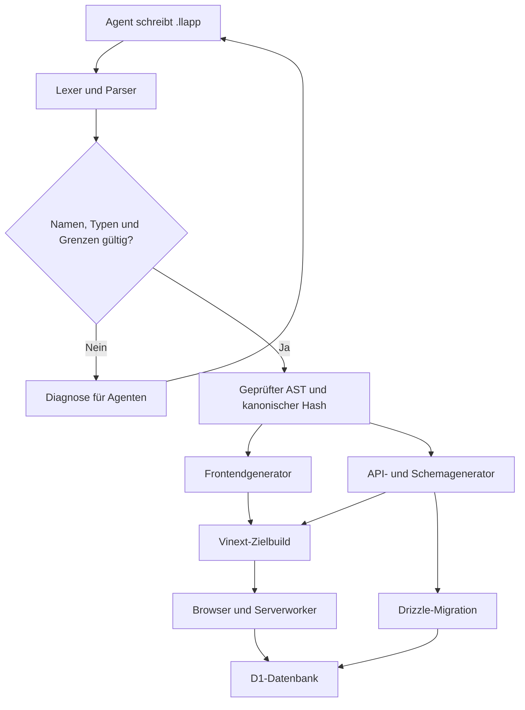
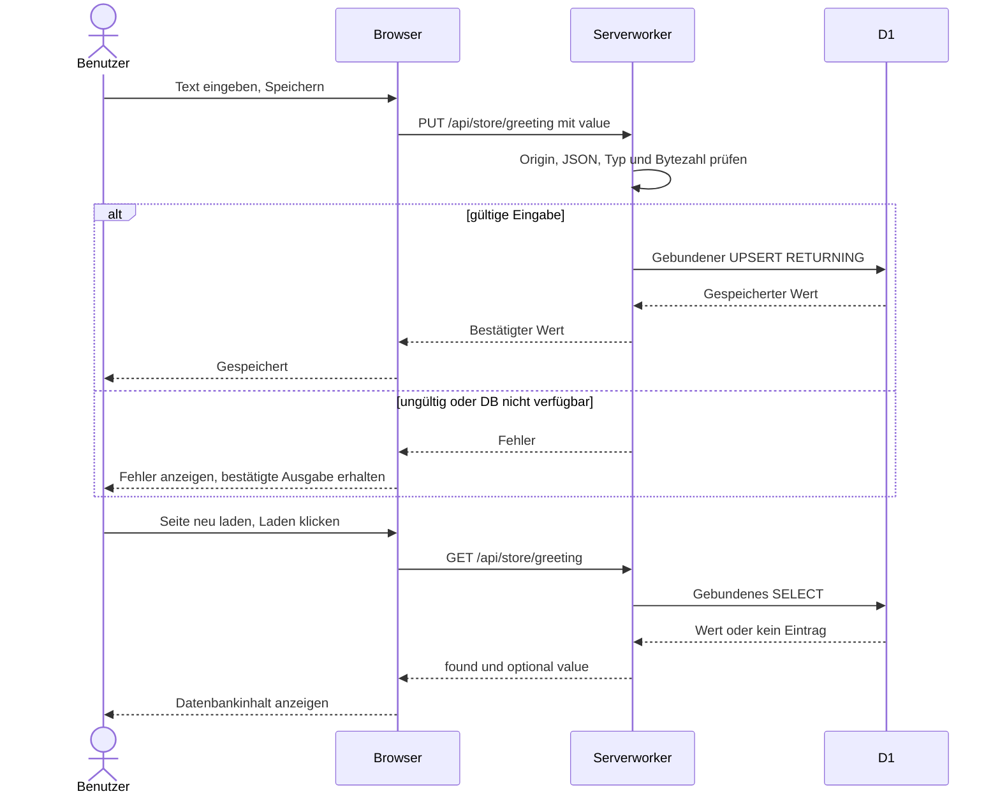
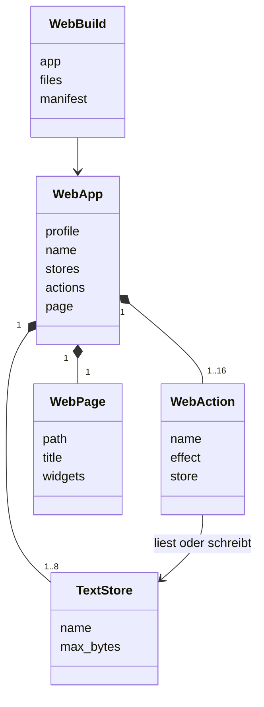

# Fullstack-Compiler w1 — Anleitung und Architektur

Release 0.3.0. Der Compiler übersetzt ein vollständiges kleines Formularprogramm aus
unserer Sprache in Browser-, Server- und Schemaquellen. Der Hoststarter liefert die
allgemeine Laufzeit, UI-Grundbausteine und den Zielbuild. Fachliche Widgets, Speicher,
Aktionen, Beschriftungen und Bindungen kommen aus der `.llapp`-Quelle.

## Vom Quelltext zur Webseite



Der eigene Compiler ist in Python implementiert. Er erzeugt TypeScript/React als
Zwischensprache; Vinext/Vite erzeugt daraus Browser-JavaScript und den Serverworker.
Drizzle erzeugt aus dem generierten Schema SQL. Chrome erhält normales HTML, CSS und
JavaScript. Die Datenbank und ihre Zugangsmöglichkeiten bleiben auf dem Server.

## Echte Agentenquellen

`examples/web/hello.llapp` wurde vom Session-Agenten `web_app_author` geschrieben.
Es deklariert einen Textspeicher, eine Schreibaktion, eine Leseaktion und vier Widgets.
`examples/web/notes.llapp` demonstriert ohne Änderung am Compiler zwei getrennte Speicher,
vier Aktionen und acht Widgets. Herkunft und Hashes stehen unter `evidence/web/`.

Ein `(Text 4096)` erlaubt höchstens 4096 UTF-8-Bytes. Ein Emoji kann mehrere Bytes
belegen. Leere Strings, Leerzeichen, Zeilenumbrüche und Unicode bleiben Daten;
NUL und ungepaarte Surrogate werden abgelehnt. Das UI zeigt die tatsächliche Bytezahl.
Der Anfangstext im Eingabefeld wird erst durch **Speichern** in die Datenbank geschrieben.
Jeder Speicher enthält den zuletzt gespeicherten Text, keine Historie.

## Installation und Kompilieren

```bash
python3 -m venv .venv
source .venv/bin/activate
python -m pip install -e '.[dev]'
llmlang compile-web examples/web/hello.llapp --out build/hello-web
```

Python 3.12+ ist erforderlich. Für die unabhängigen Runtime-Tests wird Node 24 mit
`node:sqlite` und nativer TypeScript-Typentfernung verwendet.

`compile-web` lehnt ungültige Quellen mit maschinenlesbarer Diagnose und Exitcode 1 ab.
Bei Erfolg schreibt es die Artefakte atomisch in ein neues oder leeres Verzeichnis.
Ein vorhandenes nichtleeres Verzeichnis wird nicht überschrieben.

| Ausgabe | Bedeutung |
| --- | --- |
| `app/page.tsx` | Aus Quellwidgets erzeugte Oberfläche und Ereignisbindungen |
| `app/layout.tsx`, `app/globals.css` | Dokumentrahmen und gemeinsamer Stil |
| `app/api/store/[slot]/route.ts` | API-Einstieg mit dynamischem Speicherparameter |
| `lib/w1-server.ts` | Geprüfte Requests, konfigurierte Fähigkeiten, gebundene SQL-Abfragen |
| `db/w1.ts`, `db/schema.ts` | D1-Adapter und Drizzle-Tabellenschema |
| `llmlang/source.llapp`, `llmlang/ir.json` | Kanonische Quelle und semantische Zwischenrepräsentation |
| `llmlang/manifest.json` | Zielprofil, Quellhash und SHA-256 der erzeugten Dateien |

`verify_build(path)` kompiliert die enthaltene Quelle neu und vergleicht sämtliche
Ausgabebytes. Es ist eine Integritätsprüfung, kein Beweis der Zielsprache.

## Zielbuild und Datenbank

Die Referenzintegration verwendet den Vinext-Sites-Starter mit React 19, Tailwind 4,
Drizzle, Cloudflare D1 und den vorhandenen `Button`-/`Textarea`-Komponenten unter
`@/components/ui`. Die generierten Dateien werden unverändert in diesen Starter übernommen.
Das Hostmanifest deklariert die logische D1-Bindung `DB`; es enthält keine Geheimnisse.
Der bestehende package-lock und die Starter-Buildskripte bleiben erhalten.

Anschließend erzeugt `npm run db:generate` eine SQL-Migration. Der Sites-Zielbuild
erzeugt Worker, Browserdateien und Migrationspaket. Die Migration wird einmal in der
Zieldatenbank angewandt, bevor die Anwendung benutzt wird. Keine Requestfunktion
erstellt Tabellen und kein Startcode überschreibt bestehende Werte.

Referenzumgebung: Node 24.19.0, Vinext 1.0.0-beta.5, Vite 8.0.13,
React 19.2.6, TypeScript 5.9.3, Drizzle ORM 0.45.2/Kit 0.31.10.
Der separat verwaltete Site-Quellstand enthält den vollständigen Ziel-Lockfile.
Das Compilerpaket enthält bewusst keine Kopie dieser extern verwalteten Site.

## Speichern und Laden zur Laufzeit



Die Kombination aus Appname und Speichername bildet den Primärschlüssel.
Gleichzeitige Schreibvorgänge ersetzen atomisch einen vollständigen Wert; der letzte
Commit gewinnt. Die Schreibantwort kommt aus demselben UPSERT, nicht aus einem
nachträglichen Lesen, das bereits den Wert eines anderen Schreibers liefern könnte.

Die Webseite wird privat bereitgestellt. Der Plattformzugriff schützt Seite und API.
Speicher sind innerhalb der freigegebenen Site gemeinsam; w1 besitzt keine separaten
Benutzerkonten. Die Originprüfung schützt Schreibaktionen gegen fremde Webseiten,
ersetzt aber keine Authentifizierung.

## Zentrale Klassen



`WebPage.widgets` enthält `TextInput`, `ActionButton` und `TextOutput` in Quellreihenfolge.
Parser und Validator prüfen alle Verweise sowie die Kompatibilität ihrer Textkapazitäten.

## Prüfungen und Ausbaugrenze

```bash
python -m pytest -q
python -m ruff check src tests scripts
python -m mypy --no-incremental src
```

Mit `LLMLANG_W1_SCHEMA=/absoluter/pfad/migration.sql` prüft dieselbe Runtime-Suite
die tatsächlich erzeugte Drizzle-Migration. Ohne diese Variable verwendet sie
ausdrücklich ein unabhängiges Referenz-DDL aus der Spezifikation.

Implementiert sind kleine persistente Formulare auf einer Seite: begrenzte Textspeicher,
explizite Lesen-/Schreiben-Aktionen, Eingaben, Buttons und Ausgaben. Listen, Beziehungen,
freie Queries, mehrere Routen, Layoutsprache, Businesslogik-Aufrufe in P0, Migrationen
zwischen künftigen Schema-Versionen und benutzerbezogene Autorisierung sind weiterer Ausbau.
Der bisherige P0-Factory-CLI wird dadurch nicht automatisch zum w1-Syntheseprovider;
die aktuelle Abnahme verwendet echte Session-Agenten plus den unabhängigen Compiler.
